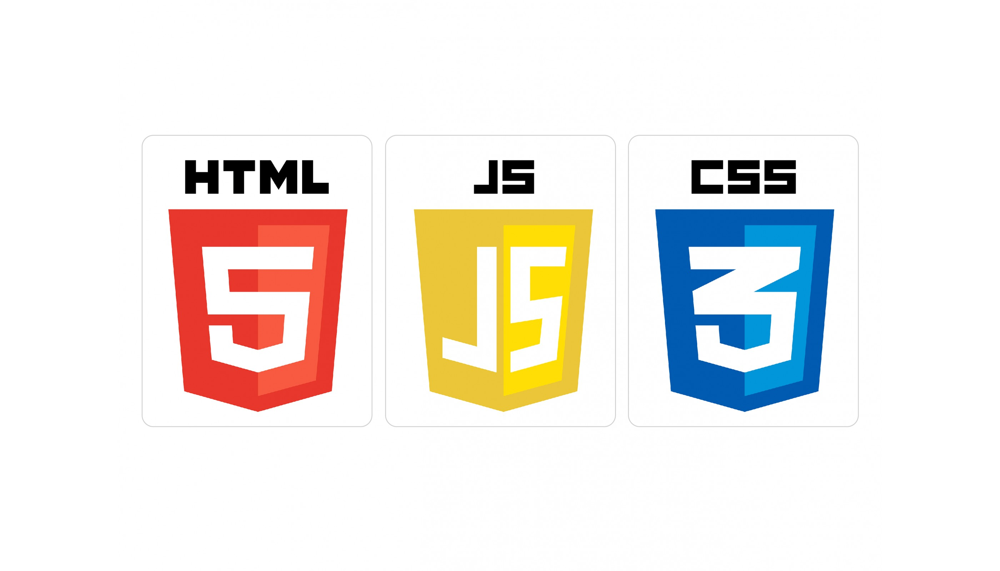

# Mixology at home

Date: October 22, 2020

By: Lisa Venneker Wand

[GitHub](https://github.com/LisaKVW) |
[LinkedIn](https://www.linkedin.com/in/lisa-venneker-wand-8413ab25/)

## Description
Site to find cocktail recipes by name or at random selection. 
Additional "pun button" added, this for fun pun by Chuck Norris.

## Technologies used

## Getting Started
Use this website for cocktail recipes you can make at home. 

## User Stories
1. As a user, I open the website by entering the site, via the entry button.
2. As a user, Iupon entering the site, I should find two search options.
3. As a user, option one will be to enter and submit a cocktail by name. This search request, will give the user the cocktail recipe.
4. As a user, you also have option two, here the user will receive a random cocktail recipe.
5. As a user, there will be an optional 'fun pun by Chuck Norris' button to start your evening.

## Wireframe

## code snippet
Code Snippet of API

## Trello link
https://trello.com/b/6Tiltpri/mixology-at-home

## API link's
1. https://www.thecocktaildb.com/
2. https://api.chucknorris.io/ 

## Credits
1. Invision, freehand
2. https://tenor.com/search/chuck-norris-gifs
3. https://www.pexels.com
